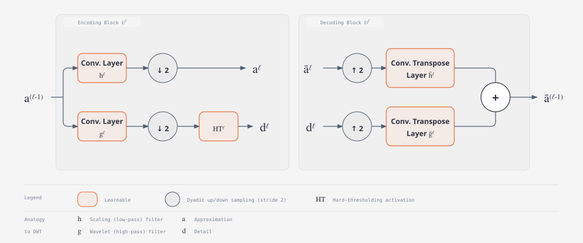
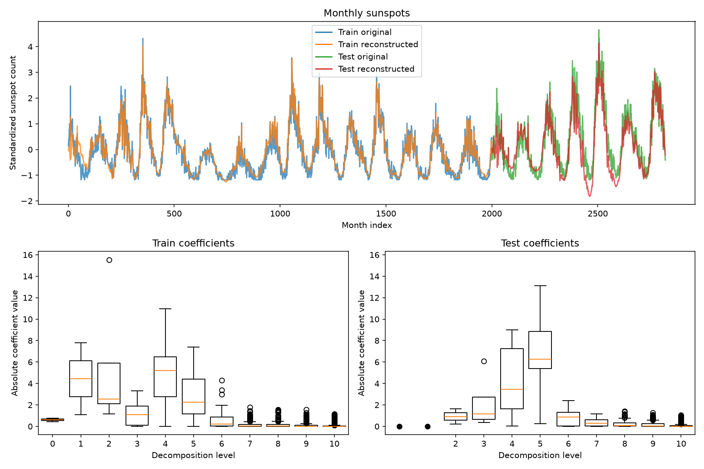

# DeSpaWN PyTorch

[](https://python.org/)
[](https://pytorch.org/)
[](https://github.com/astral-sh/uv)
[](https://github.com/astral-sh/ruff)
[](https://github.com/astral-sh/ty)
[](https://github.com/nimanzik/despawn-pytorch/actions/workflows/ci.yml)

An unofficial PyTorch implementation of the Denoising Sparse Wavelet Network.

> [!NOTE]
> DeSpaWN PyTorch is an early release. Its public API may change before
> version 1.0.

DeSpaWN learns a sparse wavelet representation of raw signals without labels.
It uses a wavelet encoder and decoder with learnable filters. The model also
learns separate positive and negative thresholds that suppress small
coefficients. Training balances signal reconstruction against coefficient
sparsity.

The package provides:

- Learnable wavelet analysis and synthesis filters.
- Four choices for sharing or separating filter kernels.
- Learnable asymmetric hard thresholding at every decomposition level.
- Reconstruction and access to thresholded approximation and detail coefficients.
- Independent processing of any number of leading batch or sensor dimensions.
- A combined reconstruction and sparsity loss for unsupervised training.

## Table of contents

- [Installation](#installation)
- [Quick start](#quick-start)
- [Decomposition and tensor shapes](#decomposition-and-tensor-shapes)
- [Architecture](#architecture)
- [Kernel constraints](#kernel-constraints)
- [API reference](#api-reference)
- [Monthly sunspot example](#monthly-sunspot-example)
- [Project scope and paper relationship](#project-scope-and-paper-relationship)
- [Citation](#citation)

## Installation

DeSpaWN PyTorch requires Python 3.12 or later. The commands below use the
[uv](https://docs.astral.sh/uv/) Python package manager.

### Core installation without PyTorch

If your project already has PyTorch, add DeSpaWN PyTorch directly from GitHub:

```console
uv add git+https://github.com/nimanzik/despawn-pytorch.git
```

### Installation with PyTorch

If you do not already have PyTorch installed, choose the build that matches
your hardware and CUDA version, and pass the corresponding name from the table
below to uv's `--extra` option.

| Extra name    | PyTorch build |
| ------------- | ------------- |
| `torch-cpu`   | CPU           |
| `torch-cu126` | CUDA 12.6     |
| `torch-cu130` | CUDA 13.0     |
| `torch-cu132` | CUDA 13.2     |

Replace `<extra-name>` with an extra name from the table:

```console
uv add git+https://github.com/nimanzik/despawn-pytorch.git \
    --extra <extra-name>
```

## Quick start

The following example trains DeSpaWN to reconstruct a batch of signals while
keeping its learned wavelet coefficients sparse:

```python
import torch

from despawn_pytorch import Despawn, DespawnLoss, get_num_levels

signals = torch.randn(8, 256)

model = Despawn(n_levels=get_num_levels(signals.shape[-1]))
criterion = DespawnLoss(sparsity_weight=1.0)
optimizer = torch.optim.NAdam(model.parameters(), lr=0.001)

model.train()
reconstruction, coefficient_penalty = model(signals)
loss = criterion(signals, reconstruction, coefficient_penalty)

optimizer.zero_grad()
loss.backward()
optimizer.step()
```

`reconstruction` has the same shape as `signals`. `coefficient_penalty` contains
one mean absolute coefficient value for each independent signal, so its shape
is `signals.shape[:-1]`.

To train with reconstruction loss alone, set `sparsity_weight=0.0`. You can
also create the model with `loss_coeff=None`, which makes the model return a
zero coefficient penalty.

## Decomposition and tensor shapes

When you need the thresholded wavelet coefficients, you can call model's
`decompose` method:

```python
model.eval()
with torch.no_grad():
    reconstruction, approximation, details = model.decompose(signals)

print(reconstruction.shape)  # torch.Size([8, 256])
print(approximation.shape)   # torch.Size([8, 1]) for eight levels
print(len(details))          # 8
```

The returned detail coefficients are **ordered from the coarsest level to the
finest level**. Each coefficient tensor keeps all leading input dimensions, but
its last dimension is shorter according to its decomposition level.

The time axis must always be last:

| Input shape              | Meaning                              | Reconstruction shape     | Penalty shape      |
| ------------------------ | ------------------------------------ | ------------------------ | ------------------ |
| `(time,)`                | One signal                           | `(time,)`                | `()`               |
| `(batch, time)`          | A batch of signals                   | `(batch, time)`          | `(batch,)`         |
| `(batch, sensors, time)` | Independent sensor signals per batch | `(batch, sensors, time)` | `(batch, sensors)` |

DeSpaWN applies the same transform independently to every item described by the
leading dimensions. It does not mix information between batches, sensors,
or other leading dimensions.

## Architecture

DeSpaWN represents a fast discrete wavelet transform as a learnable encoder and
decoder. At each decomposition level, a low-pass filter produces the approximation
for the next level. A high-pass filter produces detail coefficients. Learnable
asymmetric thresholds suppress small positive and negative coefficients. The
decoder then combines the final approximation with the saved detail coefficients
to reconstruct the signal.



The training objective combines mean absolute reconstruction error with the
mean absolute value of the thresholded coefficients:

$$
\mathcal{L} = \textrm{MAE}(x, \hat{x}) + \lambda \thinspace \textrm{Mean}(|c|)
$$

Here, $x$ is the input signal, and $\hat{x}$ is its reconstruction. The variable
$c$ contains the final approximation and all detail coefficients, while
$\lambda$ is `sparsity_weight`. The reconstruction term preserves signal
information, while the coefficient term encourages a sparse representation.

## Kernel constraints

The `kernels_constraint` option controls how filter kernels are shared. The
default is `per_layer`, which learns a separate base kernel at each decomposition
level.

| Value        | Number of base kernels | Relationship between filters                                                                                                  |
| ------------ | ---------------------- | ----------------------------------------------------------------------------------------------------------------------------- |
| `cqf`        | `1` total              | One base kernel defines every analysis and synthesis filter through the conjugate quadrature filter relationship.             |
| `per_layer`  | `n_levels`             | Each level has its own base kernel, which defines all four filters at that level.                                             |
| `per_filter` | `2 * n_levels`         | Each level has separate low pass and high pass base kernels. The matching synthesis kernels are tied to the analysis kernels. |
| `free`       | `4 * n_levels`         | Each analysis and synthesis path has an independent base kernel at every level.                                               |

More sharing reduces the number of learned parameters and keeps the model closer
to a traditional wavelet filter bank. Less sharing gives each level and path
more freedom, but it also increases the number of learned parameters.

## API reference

### `Despawn`

Main model class that applies the DeSpaWN algorithm to a signal.

```python
Despawn(
    *,
    kernel_init=8,
    kernel_learnable=True,
    kernels_constraint="per_layer",
    n_levels=1,
    loss_coeff="l1",
    threshold_init=1.0,
    threshold_learnable=True,
)
```

| Parameter             | Default       | Description                                                                                                             |
| --------------------- | ------------- | ----------------------------------------------------------------------------------------------------------------------- |
| `kernel_init`         | `8`           | A positive kernel length, or an array of initial kernel coefficients. Integer lengths use random normal initialisation. |
| `kernel_learnable`    | `True`        | Whether training updates the filter kernels.                                                                            |
| `kernels_constraint`  | `"per_layer"` | How kernels are shared. Accepted values are `"cqf"`, `"per_layer"`, `"per_filter"`, and `"free"`.                       |
| `n_levels`            | `1`           | Number of wavelet decomposition levels.                                                                                 |
| `loss_coeff`          | `"l1"`        | Whether `forward` calculates the mean absolute coefficient penalty. Set it to `None` to return zeros.                   |
| `threshold_init`      | `1.0`         | Initial magnitude of the positive and negative thresholds.                                                              |
| `threshold_learnable` | `True`        | Whether training updates the thresholds.                                                                                |

- `model(signals)` returns `(reconstruction, coefficient_penalty)`.
- `model.decompose(signals)` returns `(reconstruction, approximation, details)`.

### `DespawnLoss`

Adds mean absolute reconstruction error to the model's mean
coefficient penalty. `sparsity_weight` must be a finite, nonnegative number.

```python
DespawnLoss(sparsity_weight=1.0)
```

### `get_num_levels`

Returns `floor(log2(signal_length))`. The signal length must be an integer of
at least two.

```python
levels = get_num_levels(signal_length)
```

## Monthly sunspot example

<p align="center">
  
</p>

The repository includes a complete example that loads and standardises monthly
sunspot data. It trains DeSpaWN with a Daubechies 4 kernel, then plots the
reconstruction and learned coefficient distributions.

Clone the repository and run the example on the CPU:

```console
git clone https://github.com/nimanzik/despawn-pytorch.git
cd despawn-pytorch
uv run --group examples --extra torch-cpu \
    python examples/monthly_sunspots.py
```

Training uses 1,000 epochs by default. For a quick check without opening a plot
window, run:

```console
uv run --group examples --extra torch-cpu \
    python examples/monthly_sunspots.py --epochs 1 --no-show
```

Use `--output figure.png` to save the plot. If Matplotlib cannot open a window,
the example uses a noninteractive backend and saves the figure in the system
temporary directory.

## Project scope and paper relationship

DeSpaWN PyTorch implements the learnable wavelet model described in ["Fully
Learnable Deep Wavelet Transform for Unsupervised Monitoring of High-Frequency
Time Series"](https://doi.org/10.1073/pnas.2106598119) by Gabriel Michau,
Gaetan Frusque, and Olga Fink.

> [!IMPORTANT]
> The repository implements the DeSpaWN model and its training loss. It does not
> reproduce the paper's classification, anomaly detection, or benchmark
> pipelines. The repository does not claim the paper's reported results.

The paper applies DeSpaWN to sparse signal representation, classification, and
unsupervised anomaly detection. Read the [published paper](https://doi.org/10.1073/pnas.2106598119)
for the method, experiments, and analysis.

## Citation

If you use DeSpaWN in research or in a project, cite the original paper:

```bibtex
@article{michau2022fully,
  author  = {Michau, Gabriel and Frusque, Gaetan and Fink, Olga},
  title   = {Fully Learnable Deep Wavelet Transform for Unsupervised Monitoring of High-Frequency Time Series},
  journal = {Proceedings of the National Academy of Sciences},
  year    = {2022},
  volume  = {119},
  number  = {8},
  pages   = {e2106598119},
  doi     = {10.1073/pnas.2106598119}
}
```
