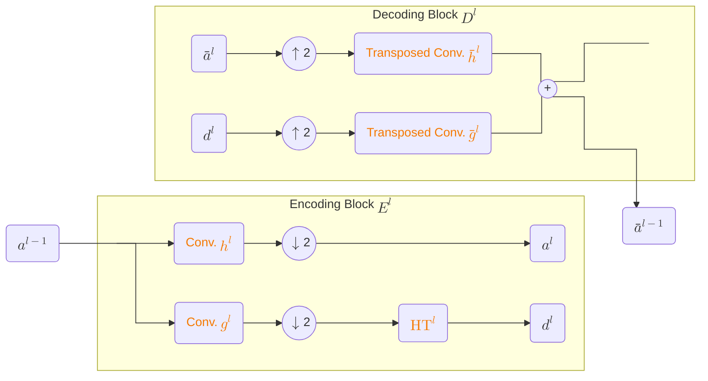

```mermaid
%%{init: {"flowchart": {"curve": "stepAfter"}}}%%

graph LR
    classDef hiddenNode width:0px,height:0px,min-width:0px,font-size:0px,padding:0px;
    classDef coloredText color:#f57900;

    A("`$$a^{l-1}$$`") --- DUMMY_1:::hiddenNode

    subgraph EB[Encoding Block $$\thinspace E^l$$]
        direction LR
        DUMMY_1 --> H("`Conv. $$\thinspace h^l$$`")
        H --> DS_H(("`$$\downarrow$$ 2`"))
        DS_H ---> AL("$$a^l$$")

        DUMMY_1 --> G("`Conv. $$\thinspace g^l$$`")
        G --> DS_G(("`$$\downarrow$$ 2`"))
        DS_G --> HT("$$\textnormal{HT}^l$$")
        HT --> DL_EB("$$d^l$$")
    end

    H:::coloredText
    G:::coloredText
    HT:::coloredText


    subgraph DB[Decoding Block $$\thinspace D^l$$]
        direction LR
        A_BAR("`$$\bar{a}^l$$`") --> UP_H(("`$$\uparrow$$ 2`"))
        UP_H --> H_BAR("`Transposed Conv. $$\thinspace \bar{h}^l$$`")
        H_BAR --- SUM(("+"))

        DL_DB("$$d^l$$") --> UP_G(("`$$\uparrow$$ 2`"))
        UP_G --> G_BAR("`Transposed Conv. $$\thinspace \bar{g}^l$$`")
        G_BAR --- SUM

        SUM --- DUMMY_4:::hiddenNode
    end

    SUM --> A_BAR_("`$$\bar{a}^{l-1}$$`")

    DUMMY_3:::hiddenNode
    SUM:::sum

    H_BAR:::coloredText
    G_BAR:::coloredText

    %%% Side-by-side connection between E and D with invisible connection
    EB ~~~ DB
```
